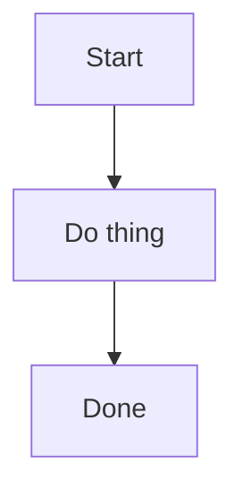

# Blog Guide — Personal Reference

A quick reference for everything you need to run this Hugo + Blowfish blog.

---

## Publishing a Post

```bash
# 1. Create the post file
hugo new content posts/my-post-title.md

# 2. Edit it — it lives at:
#    content/posts/my-post-title.md

# 3. When ready to publish, make sure front matter has:
#    draft: false

# 4. Push to publish
git add content/posts/my-post-title.md
git commit -m "post: your title"
git push
```

Live at https://ogthemepark.github.io/ within ~1 minute.

---

## Front Matter Reference

Every post starts with a front matter block. Here's everything useful:

```yaml
---
title: "Your Post Title"
date: 2026-03-29
lastmod: 2026-03-29         # optional: show "last updated" date
tags: ["tag1", "tag2"]
categories: ["category"]    # optional
draft: false                # true = not published, false = published
description: "A short summary shown in post listings and SEO."
cover:
  image: "cover.jpg"        # optional: place image in same folder as post
  alt: "description"
  caption: "caption text"
---
```

**The most common mistake:** forgetting to set `draft: false`. If your post doesn't show up, this is why.

---

## Organizing Posts with Images

For posts with images, use a folder instead of a single file:

```
content/posts/
└── my-post-with-images/
    ├── index.md        ← your post content
    └── cover.jpg       ← image lives here, reference as "cover.jpg"
```

For a single post with no images, a plain `.md` file is fine.

---

## Hugo Commands

> **Note:** Hugo is installed at `~/.local/bin/hugo`
> Add to your shell if needed: `export PATH="$HOME/.local/bin:$PATH"` in `~/.zshrc`

```bash
# Preview locally (auto-reloads on save)
hugo server

# Preview including draft posts
hugo server -D

# Build the site (output goes to public/)
hugo --gc --minify

# Create a new post
hugo new content posts/post-title.md

# Check your config
hugo config
```

Local preview is at http://localhost:1313/ — changes reload instantly as you save.

---

## Blowfish Theme: Useful Config

Your site config is at `hugo.yaml`. Key Blowfish settings under `params:`:

```yaml
params:
  colorScheme: "ocean"        # change this to change site colors
  defaultAppearance: "dark"   # "light" or "dark"
  autoSwitchAppearance: true  # follows OS preference

  # Available color schemes:
  # avocado, blowfish, congo, dragon, fire, forest, noir, ocean, princess,
  # rose, slate, sunset, terminal, tigerblood, tokyonight

  enableSearch: true          # full-text search
  enableCodeCopy: true        # copy button on code blocks

  author:
    name: "ogthemepark"
    image: "img/avatar.jpg"   # optional: place in assets/img/
    bio: "Learning in public." # optional: short bio
    links:
      - github: "https://github.com/ogthemepark"
```

After editing `hugo.yaml`, push and it deploys automatically.

---

## Writing in Markdown

### Code blocks (with syntax highlighting)

````markdown
```python
def hello():
    print("Hello, world!")
```
````

Languages supported: python, javascript, bash, go, rust, yaml, json, sql, and many more.

### Callouts / Alerts (Blowfish feature)

```markdown

This is a note.



This is a warning.



This is a tip.

```

### Diagrams (Mermaid)

````markdown

````

### Math (KaTeX)

```markdown

$$E = mc^2$$
```

---

## Common Gotchas

**Post not showing up after push?**
- Check `draft: false` in front matter — this is the #1 cause
- Check the `date` isn't set in the future

**GitHub Actions failed?**
- Go to repo → Actions tab → click the failed run → read the error
- Most common cause: `submodules: recursive` not cloning theme properly (shouldn't happen with this setup)

**Local preview looks wrong but site looks fine (or vice versa)?**
- Run `hugo server` locally and check http://localhost:1313/
- The `baseURL` in `hugo.yaml` only matters for production builds, not local preview

**Images not showing?**
- Make sure the image is committed to git (`git add` it explicitly)
- If using a cover image, place it in the same folder as `index.md`, not in `static/`

**Theme looks broken after update?**
- Pin back to the previous tag: `cd themes/blowfish && git checkout v2.100.0 && cd ..`
- Check Blowfish release notes for breaking changes

**`hugo: command not found` in terminal?**
- Hugo is at `~/.local/bin/hugo`
- Add `export PATH="$HOME/.local/bin:$PATH"` to `~/.zshrc` and restart terminal

---

## Updating the Blowfish Theme

```bash
cd themes/blowfish
git fetch --tags
git checkout v<new-version>   # e.g. v2.101.0
cd ..
git add themes/blowfish
git commit -m "chore: update Blowfish to v<new-version>"
git push
```

Check https://github.com/nunocoracao/blowfish/releases for new versions.

---

## Adding a Custom Domain (when ready)

1. Create `static/CNAME` with just your domain:
   ```
   www.yourdomain.com
   ```

2. Update `baseURL` in `hugo.yaml`:
   ```yaml
   baseURL: "https://www.yourdomain.com/"
   ```

3. At your DNS registrar, add:
   - Four A records pointing `@` to:
     ```
     185.199.108.153
     185.199.109.153
     185.199.110.153
     185.199.111.153
     ```
   - One CNAME record: `www` → `ogthemepark.github.io`

4. In GitHub repo → Settings → Pages → Custom domain → enter your domain → Save → Enforce HTTPS

---

## Git Quick Reference

```bash
git status                  # what's changed
git add content/posts/      # stage posts
git add -p                  # interactively pick what to stage
git log --oneline -10       # last 10 commits
git diff                    # see unstaged changes
```

---

## Useful Links

- Blowfish docs: https://blowfish.page/docs/
- Blowfish color schemes: https://blowfish.page/docs/configuration/#colour-schemes
- Hugo docs: https://gohugo.io/documentation/
- Hugo front matter reference: https://gohugo.io/content-management/front-matter/
- Markdown cheatsheet: https://www.markdownguide.org/cheat-sheet/
